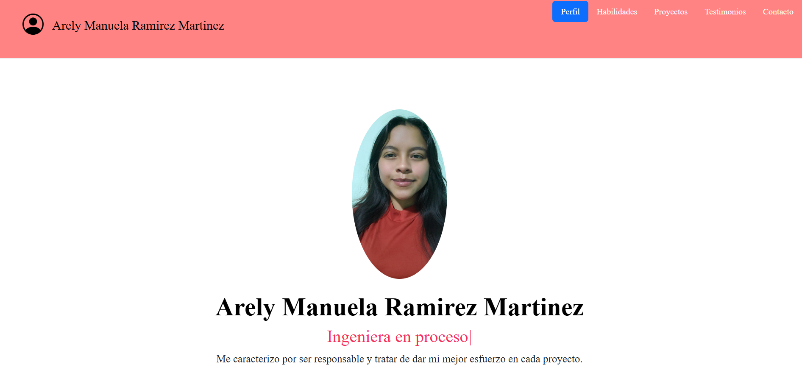

## Portafolio de proyectos
¡Hola! 👾 Mi nombre es **Arely Rmirez** actualmente estudió la carrera de Ingenieria en Robotica Y Mecatronica 🦾 y me apasiona aprender cosas nuevas, en este repositorio encontrarás más información sobre mí 🤩.
_________________
### El proyecto cuenta con las siguientes secciones:

- 🛠️ Habilidades 
- 💡 Proyectos 
- 👤 Colaboraciones 
- 📧 Contacto 

### Creado con 🖥️:
- HTML
- CSS
- Javascript

    
    

___________
### Vista previa
<!-- Poner imagenes proyecto cuando este listo -->

*Espero trabajemos juntos pronto*
<!-- Para poner links [https://github.com/ely18mtz/Portafolio-de-Proyectos.git] -->
https://github.com/ely18mtz/Portafolio-de-Proyectos.git

Correo 📧:
[arelyramirezmtz18@gmail.com](mailto:arelyramirezmtz18@gmail.com)
